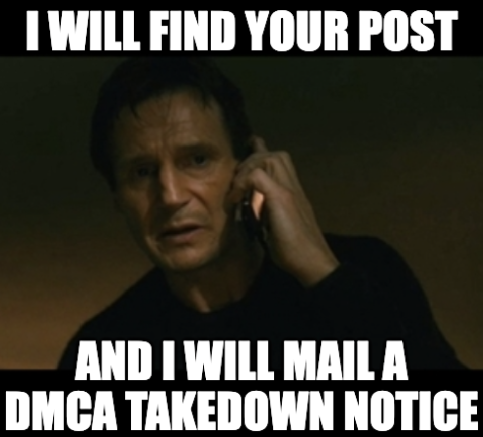

Well, Hello World! Here's my blog and I don't really know how to start it.

I've been thinking about writing one for almost a year; even drafted a few posts, but never got around to completing them or posting them.
Have you ever had that feeling: that surge of inspiration and determination you get when you decide to pick up something that interests you, but all that fades away as any time you try to do it, it isn't perfect as you'd like it to be?

Yes, that's me with most things. And I really need to change. I've decided to use this blog as my **accountability ledger** and to keep trying to get things done instead of trying to get things done the _right way_. Idk how many people are gonna read this, but writing down things in a ranty-conversational format seems like a good reality check for future-me and if reading these blog posts helps someone else, I'd be really happy, even if it's just for an audience of 1.

## What made me want to change things?

I've been a member of many online communities for the past 2 years and I've noticed how much people have grown and I'm very inspired by people who are trying so many new things in a more public and open atmosphere, working to break into tech, while helping so many people that are just starting out. Many of them have made massive leaps and have moved on to do great things. I want to be like them. I want to be more open to trying new things and learn, grow, and share on a more public platform.

I'm quite introverted and I've always refrained from speaking in public, even though my diction and pronunciation haven't ever been bad. It's more like an 'inertia of confidence': I've never been comfortable about speaking in public, so I've never done it. In the past year, I've been participating not only in speaking at public-speaking events, but also organising and moderating such sessions at [EddieHub](https://www.eddiehub.org/): My favourite open source community. These sessions provided a safe-space where I could engage in conversation with other people without worrying about every little detail that can go wrong.

Recently, I was selected to participate in the [EddieHub Ambassador programme](https://www.eddiehub.org/ambassador-program), and I'm just delighted by how the program is intended to nudge and support the ambassadors to become more engaged in content creation and community development. All the advice that Eddie, Sara and the other Ambassadors have shared has given me a better idea about how I can embark on this journey, and I feel greatful for the extra accountability that I can start complying with.

## Things I want to do in what remains of this year (2022)

This is certainly not an exhaustive list, and may keep growing in size as time passes, but I think it's a good place to start.

- [x] Teach a programming concept to a group of people.
- [ ] Host a Twitter Space.
- [ ] Make a Tutorial video or a Casual programming video that is longer than 5 minutes.
- [ ] Write a blog post on "why working with microprocessors can be interesting for a CS student".
- [ ] Write a blog post on "why many student communities need an attitude change"
- [ ] Write a blog post roughly every month.
- [ ] Write a blog post on my developer-journey so far.
- [ ] Bring back my old discord bot project - **TearDrops**, and add following features to it:
  - [ ] Improved currency system, where users are given credits(tears) based on sentiment analysis(sadder messages == more tears)
  - [ ] A time formatter
  - [ ] A poll command
  - [ ] A tear-themed discord-bot-based game
  - [ ] *Try messing around with linking GPT-J and random messages on discord to get a conversational response from the bot (_maybe_)
- [ ] Make some good friends at university
- [ ] Give one in-person talk on any topic
- [ ] Start working on two of my projects from my project-ideas pile
- [ ] Make a simple compiler
- [ ] Start making "projects-for-learning-something" more public
- [ ] * Research ways to make a plugin that can check blog posts for total plagiarism and link users to original blog post (_maybe_)
- [ ] Make a portfolio website for myself.
- [ ] Visit an in-person hackathon or meetup and distribute my rainbow emoji stickers (without feeling embarresed)
- [ ] Focus a little bit on health - more exercises, fewer donuts, more screen-breaks, fewer 4-hour-work-sessions, more running, fewer dine-outs.
- [ ] Try participating in more hackathons.
- [ ] Try to do one or two live-coding events or challenges.
- [ ] Try to meet more people in-person.

## Things I want to add to this blog

- [ ] Categories
- [ ] Pinned Posts
- [ ] Previous - Next buttons
- [ ] Comments Plugin
- [ ] Light Mode (yes. people that use it exist. it isn't bad. don't judge people if they use it.)
- [ ] More Accessibility(testing if the blog is accessible, adding audio version for blogs, theme-switcher with accessibly options, image alt tag checker, etc.)
- [ ] Home page redisign
- [ ] *A log section: My daily standup (_maybe_)
- [ ] More Potatoes...

## Final thoughts

Welp, a new chapter begins. I really hope that this blog adds value to me as well as other people. Special thanks to [Naomi Carrigan](https://www.naomi.lgbt/) for suggesting [Gatsby's blog starter](https://www.gatsbyjs.com/starters/gatsbyjs/gatsby-starter-blog/) when I was stuck between multiple choices for a SSR.

If you find any bugs while using the blogs, please make an issue on my [repo](https://github.com/Vyvy-vi/blog). If you have any issues with the content hosted on this website, please email me at [vyom.j@protonmail.com](mailto:vyom.j@protonmail.com).

If you want to steal the content from this blog, without permission and without attribution, to present it as your own...

